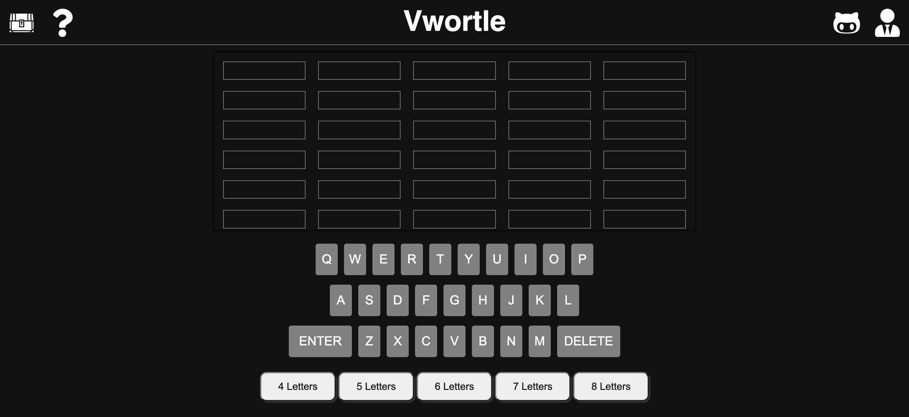
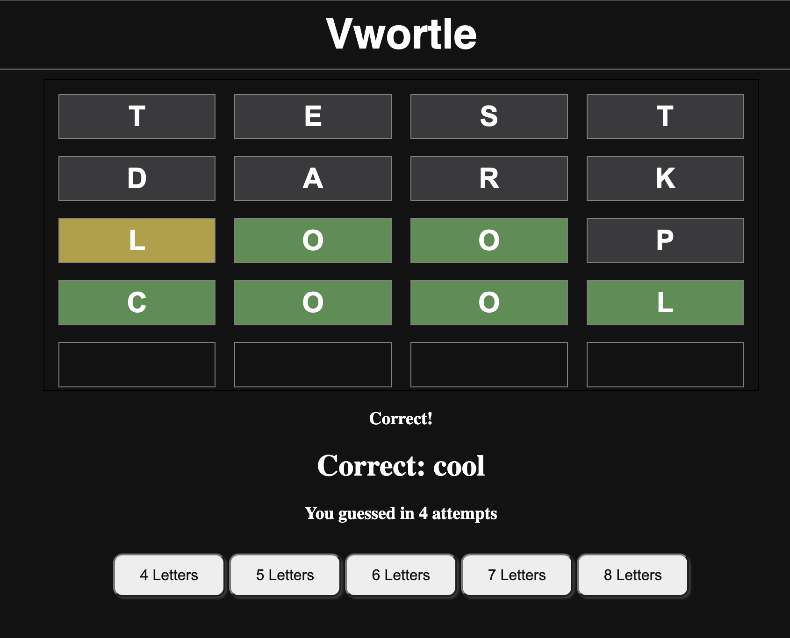
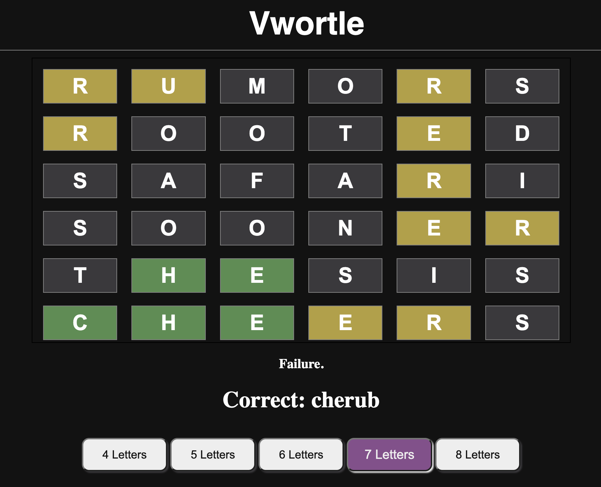

# VWORTLE

## License
### 
### [MIT](https://opensource.org/licenses/MIT)

## Description

React App mock up of NYT's Wordle, but with multiple options for length of word.

By: [Vincent Toon](https://github.com/Vincenttoon)

## Table of Contents

* [Live Link](#live-link)

* [Installation](#installation)

* [Usage](#usage)

* [Rules](#rules)

* [Things Learned](#things-learned)

* [Future Improvements](#future-improvements)

* [Contributors](#contributors)

* [Questions?](#questions)

## Live Link

* [Vwortle Live Deployment](https://vwortle-vwtd.vercel.app/)

## Installation

* Head to the repository to download or view this code: [VWORTLE](https://github.com/Vincenttoon/vwortle)

## Usage

* Go to live link
* Try different word lengths
* Enjoy

## Rules

- 4 Letters -> You must solve the 4 letter word in 5 guesses

- 5 Letters -> You must solve the 5 letter word in 6 guesses

- 6 Letters -> You must solve the 6 letter word in 6 guesses

- 7 Letters -> You must solve the 7 letter word in 7 guesses

- 8 Letters -> You must solve the 8 letter word in 8 guesses

## Things Learned

- First usage of `useContext` library. Context provides a way to pass data through the component tree without having to pass props manually at every level.

- More practice with `fetch()`. The fetch() function is a modern JavaScript API for making network requests (HTTP requests) to servers. 

- Further implementation of React tools, including `useCallback`, `useState`, and `useEffect`

- Good practice adjusting React/JS rules based on size of board.

## Future Improvements

- Nail down responsiveness (in browser looks and functions well, on my phone its weird?)
- Stats page to track how a user is doing would be nice, similar to current Wordle

## Contributors

* [Online Word Bank](https://eslforums.com/category/words-with-letters/)

## Questions?

Questions, comments, or concerns? Please Email me at:
* vincenttoon22@gmail.com